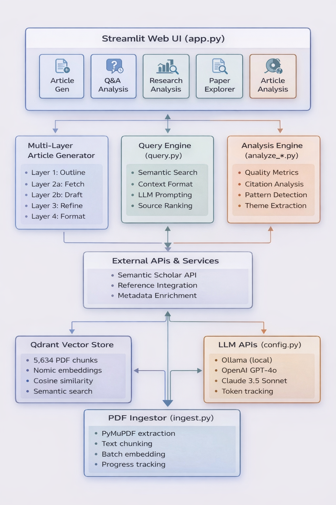

# Academic Paper Analysis & Generation System

**By Roan Guilherme Weigert Salgueiro**

## 🎥 Project Overview Video

[](https://www.youtube.com/watch?v=ba-PnrX5Ysg)

**[▶️ Watch the full demonstration on YouTube](https://www.youtube.com/watch?v=ba-PnrX5Ysg)**

---

An advanced RAG (Retrieval-Augmented Generation) system that analyzes 5,634 academic papers using AI-powered analytics, quality metrics assessment, and automated article generation. Built with multi-layer architecture and external reference integration.

This system enables comprehensive research understanding by identifying future work opportunities, analyzing related work, and creating analytical foundations from thousands of papers. It can search for relevant articles across the corpus and generate insights, as demonstrated in the generated article [Contextualization of Learning](outcomes/Contextualization%20of%20Learning.pdf). The system also produces self-analytical articles that evaluate their own quality and identify improvements, such as [IEEE Analysis Article](outcomes/ieee_analysis_Article.pdf). All important analysis patterns and findings are documented in the comprehensive [IEEE Patterns Summary](output/ieee_patterns_summary.json).

## Analysis Results & Corpus Metrics

### 📚 Dataset Overview (5,634 Papers)
- **Data Source**: [IEEE Access Journal (2025)](https://ieeexplore.ieee.org/xpl/RecentIssue.jsp?punumber=6287639)
- **Total Corpus Size**: 5,634 academic papers fully indexed and analyzed (curated selection from 13,000+ papers accepted in 2025)
- **Citation Network**: 225,855 references extracted across the entire corpus
- **Paper Length Distribution**: 2204 - 9,301 words (avg 6,630, median 6,085including the references word count)
- **Section Complexity**: 1 - 23 sections per paper (avg 20.1)
- **Reference Density**: 15 - 80 references per paper (avg 42)
- **In-text Citations**: 20 - 590 citations per paper (avg 137.5)
- **Reference Depth**: Average 1,981 words per references section

### 📊 Detailed Corpus Statistics 
| Metric | Minimum | Mean | Median | Maximum |
|--------|---------|------|--------|---------|
| **Word Count** | 2422 | 6,630 | 6,085 | 9,301 |
| **References Count** | 15 | 42 | 38 | 80 |
| **In-text Citations** | 20 | 137.5 | 107 | 590 |
| **References per 1k Words** | 3 | 6.5 | 6.5 | 12 |
| **Section Count** | 1 | 20.1 | 18 | 23 |
| **Avg Sentence Length** | 5.5 | 18.0 | 17.5 | 97.1 |
| **Figures per Paper** | 3 | 9 | 7 | 15 |
| **Tables per Paper** | 1 | 4 | 3 | 8 |

### 📈 Key Insights from Corpus Analysis
- **Structural Complexity**: Up to 23 sections demonstrates highly detailed technical papers
- **Research Depth**: Comprehensive citation networks with 225,855+ references analyzed
- **Quality Standards**: 99% contain mathematical content, 94% include comparative analysis

### 🔬 Deep Quality Assessment (Full Corpus: 5,634 Papers)
Comprehensive analysis across the entire dataset:

| Metric Category | Corpus Findings |
|----------------|-----------------|
| **Mathematical Rigor** | 99% (5,577) contain mathematical content<br>Average 41.36 math indicators per paper<br>91% include statistical testing |
| **Reproducibility** | 19.5% (1,100) provide code/GitHub links<br>47% report multiple experimental runs<br>59% include error reporting (std, variance) |
| **Research Standards** | 94% (5,313) include comparative analysis<br>88% acknowledge limitations<br>32% perform ablation studies |
| **Content Richness** | Average 9 figures, 4 tables per paper<br>4.94 unique performance metrics per paper<br>29.34 dataset mentions per paper |
| **Academic Writing** | Flesch Reading Ease: 41.74 (College level)<br>Grade Level: 9.73 (College freshman)<br>82% make novelty claims, 58% claim SOTA |

### 🏆 Top Publishing Venues in Corpus
| Venue | Citation Count | Field |
|-------|----------------|-------|
| Proceedings of the IEEE | 11,622 | Engineering |
| CVPR | 6,546 | Computer Vision |
| NeurIPS | 3,465 | Machine Learning |
| Machine Learning (journal) | 2,856 | ML Theory |
| ICCV | 2,537 | Computer Vision |
| ECCV | 1,364 | Computer Vision |
| Neural Computation | 869 | Neural Networks |
| JMLR | 568 | Machine Learning |

### 📈 Publisher Distribution & Citation Analytics
| Publisher Family | Citations | Market Share |
|------------------|-----------|--------------|
| IEEE | 63,412 | 28.1% |
| arXiv | 15,315 | 6.8% |
| ACM | 14,626 | 6.5% |
| Springer | 4,392 | 1.9% |
| NeurIPS | 4,043 | 1.8% |
| Nature | 1,999 | 0.9% |
| Elsevier | 1,655 | 0.7% |
| AAAI | 1,550 | 0.7% |
| ECCV | 1,331 | 0.6% |
| ICLR | 646 | 0.3% |
| ICML | 594 | 0.3% |
| Other Publishers | 113,936 | 50.4% |

### 🌐 Citation Network Intelligence
- **Total References Analyzed**: 225,855 citations across 5,634 papers
- **Citation Density**: Average 6.5 references per 1,000 words
- **Peak Citation Years**: 2024 (30,293), 2023, 2022
- **Citation Velocity**: 90% of references from last 15 years
- **Most Influential Works** (within corpus):
  1. "Attention Is All You Need" - 149 citations
  2. "Adam: A Method for Stochastic Optimization" - 140 citations
  3. "Deep Residual Learning" - 126 citations
  4. "Dropout: A Simple Way to Prevent Neural Networks" - 111 citations
  5. "Batch Normalization" - 107 citations

### 📝 IEEE Article Word Count Guidelines (Based on 5,671 papers + Reference Analysis)

| Section | Target Words | % of Body | % of Total |
|---------|--------------|-----------|------------|
| **Abstract** | 91 | 2.0% | 1.4% |
| **Introduction** | 548 | 12.0% | 8.4% |
| **Related Work** | 914 | 20.0% | 14.0% |
| **Methodology** | 1,142 | 25.0% | 17.4% |
| **Experiments** | 685 | 15.0% | 10.5% |
| **Results** | 685 | 15.0% | 10.5% |
| **Discussion** | 366 | 8.0% | 5.6% |
| **Conclusion** | 137 | 3.0% | 2.1% |
| **Article Body Total** | **4,569** | **100%** | **69.8%** |
| **References** | **1,981** | - | **30.2%** |
| **TOTAL ARTICLE** | **6,550** | - | **100%** |

**Key Observations:**
- Introduction has the highest presence rate (98.9%), making it nearly universal
- Methodology sections are typically the longest (mean 2,338 words)
- References constitute 30.2% of total article word count (avg 1,981 words)
- Abstract word count varies significantly, suggesting different journal requirements

---

## 🛠️ System Features & Capabilities

### 📊 **Advanced Analytics & Quality Assessment** (Primary Feature)
Comprehensive analysis engine that evaluates academic papers across multiple dimensions:
- **Reproducibility Metrics**: Code availability, random seeds, error reporting
- **Statistical Rigor**: Mathematical content density, statistical tests, p-values
- **Research Quality**: Comparisons, ablation studies, contribution statements
- **Citation Network Analysis**: 225,855 references analyzed across corpus
- **Readability Assessment**: Flesch scores, grade levels, clarity metrics
- **Pattern Detection**: IEEE structure compliance, common methodologies

### 🔍 **Intelligent Q&A & Research Tools**
- Semantic search across 5,634 papers using vector embeddings
- AI-powered answers with inline citations and source excerpts
- Theme extraction and trend analysis
- Paper explorer with advanced filtering
- Batch processing capabilities

### ✍️ **Multi-Layer Article Generation**
4-layer system producing IEEE-formatted academic articles:
- **Layer 1**: Intelligent outline generation from research topics
- **Layer 2a**: External reference fetching via Semantic Scholar API
- **Layer 2b**: Draft generation with proper citations
- **Layer 3**: Content refinement and quality enhancement
- **Layer 4**: IEEE two-column formatting with MathJax equations

---

## 📚 User Guide

### Quick Start

#### Prerequisites
- Python 3.8+
- Docker (for Qdrant vector database)
- Ollama (for local LLM) or API keys for OpenAI/Claude

#### Installation
```bash
# Setup environment
python -m venv venv && source venv/bin/activate
pip install -r requirements.txt

# Start Qdrant
docker run -p 6333:6333 qdrant/qdrant

# Ingest papers and launch app
python ingest.py
streamlit run app.py
```

### 💡 Usage

The system provides **5 main interfaces** accessible via Streamlit tabs:

1. **📊 Article Analysis** - Run quality metrics, reproducibility checks, citation analysis
2. **✍️ Article Generation** - Generate IEEE-formatted papers with 4-layer system
3. **🔍 Q&A Analysis** - Ask questions, get cited answers from corpus
4. **🔬 Research Analysis** - Extract themes, trends, and patterns
5. **📚 Paper Explorer** - Browse, filter, and explore the paper collection

**Command-Line Analysis:**
```bash
# Run quality metrics on papers
python analyze_quality_metrics.py

# Analyze citation patterns
python analyze_references_in_bibliographies.py

# Q&A from command line
python query.py "What are the main approaches to neural network optimization?"
```

## 🏗️ Architecture



## 📁 Project Structure

```
Roan-IEEE/
├── app.py                              # Main Streamlit web interface
├── ingest.py                          # PDF ingestion and vector storage
├── query.py                           # Search and answer engine
├── config.py                          # LLM configuration and API handlers
├── template.py                        # Article generation templates
│
├── Multi-Layer Article Generation:
│   ├── layer1_outline_ui.py          # Layer 1: Outline generation
│   ├── layer2_external_ui.py         # Layer 2a: External reference fetching
│   ├── layer2_draft_ui.py            # Layer 2b: Draft generation
│   ├── layer3_refine_ui.py           # Layer 3: Content refinement
│   └── layer4_format_ui.py           # Layer 4: IEEE formatting & PDF export
│
├── Analysis Scripts:
│   ├── analyze_ieee_patterns.py      # IEEE paper structure analysis
│   ├── analyze_quality_metrics.py    # Quality metrics computation
│   ├── analyze_references_in_bibliographies.py  # Citation analysis
│   ├── analyze_sample_patterns.py    # Sample pattern detection
│   └── analyze_themes.py             # Theme extraction
│
├── UI Components:
│   ├── article_analysis_ui.py        # Article analysis interface
│   └── article_analysis_ui.py.broken # Backup version
│
├── Configuration:
│   ├── config/
│   │   └── ieee_constraints.py       # IEEE formatting constraints
│   ├── .env                          # Environment variables & API keys
│   └── requirements.txt              # Python dependencies
│
├── Data & Output:
│   ├── downloaded_pdfs/              # 5,634 academic papers
│   ├── output/                       # Analysis results & metrics
│   │   ├── sample_analysis_summary.json
│   │   ├── quality_metrics_summary.json
│   │   ├── references_analysis_summary.json
│   │   └── [additional analysis files]
│   └── venv/                         # Virtual environment
│
└── Documentation:
    ├── README.md                     # This file
    ├── IMPLEMENTATION_COMPLETE.md    # Implementation status
    ├── INTEGRATION_COMPLETE.md       # Integration documentation
    └── [additional documentation]
```

## ⚙️ Configuration

### Embedding Model
- **Model**: `nomic-ai/nomic-embed-text-v1.5`
- **Dimension**: 768
- **Prefix for documents**: `"search_document: "`
- **Prefix for queries**: `"search_query: "`

### Chunking Strategy
- **Chunk size**: 1000 characters
- **Overlap**: 100 characters
- **Rationale**: Balances context preservation with retrieval precision

### Vector Database
- **Database**: Qdrant
- **Collection**: `academic_papers`
- **Distance metric**: Cosine similarity
- **Host**: `localhost:6333`

### LLM Models
- **Ollama**: `qwen2.5:7b` (local, free)
- **OpenAI**: `gpt-4o` (requires API key)
- **Claude**: `claude-3-5-sonnet-20241022` (requires API key)

## ⚡ Performance

### Core Operations
- **PDF Ingestion**: ~2-5 PDFs/second (depends on PDF size)
- **Semantic Search**: <1 second for 15 results
- **Q&A Generation**: 5-30 seconds (depends on LLM)

### Multi-Layer Article Generation
- **Layer 1 (Outline)**: 10-30 seconds
- **Layer 2a (External References)**: 30-60 seconds (with Semantic Scholar API)
- **Layer 2b (Draft)**: 2-5 minutes (depends on word count and LLM)
- **Layer 3 (Refinement)**: 1-3 minutes
- **Layer 4 (IEEE Formatting)**: 10-30 seconds
- **Total Generation Time**: 4-10 minutes for a complete IEEE-formatted article

### Analysis Operations
- **Quality Metrics Analysis**: ~1-2 seconds per paper
- **Citation Network Analysis**: ~5-10 seconds for full corpus
- **Theme Extraction**: 1-3 minutes (depends on corpus size)
- **Pattern Detection**: 30-60 seconds

### System Capacity
- **Vector Database**: 5,634 papers indexed
- **Total Embeddings**: ~50,000+ text chunks
- **Concurrent Users**: Supports single-user local deployment
- **Memory Usage**: ~2-4 GB RAM (depends on LLM choice)

## 🛠️ Advanced Features

- **Custom Templates**: Modify article structures for different paper types
- **External Reference Integration**: Semantic Scholar API enriches articles with additional citations
- **IEEE Formatting**: Automatic two-column layout with MathJax equations and PDF export
- **Batch Processing**: Analyze multiple papers or run batch Q&A queries
- **Export Options**: Markdown, PDF, JSON, and CSV formats

---

## 🔧 Technology Stack

**Built with**: 
- **Frontend**: Streamlit (Multi-tab interface)
- **Vector Database**: Qdrant (5,634 papers indexed)
- **Embeddings**: Sentence Transformers (Nomic Embed v1.5)
- **LLM Providers**: Ollama (local), OpenAI (GPT-4o), Anthropic (Claude 3.5 Sonnet)
- **External APIs**: Semantic Scholar (reference enrichment)
- **PDF Processing**: PyMuPDF, Pandoc
- **Analysis**: NumPy, Pandas, textstat
- **Formatting**: MathJax, IEEE LaTeX templates

**System Version**: Multi-Layer RAG with External Reference Integration (v2.0)

---

## 👤 Author

**Roan Guilherme Weigert Salgueiro**

*AI Engineer specializing in RAG systems, academic paper analysis, and automated content generation*

This project demonstrates expertise in:
- Large-scale document analysis and quality assessment
- Multi-layer RAG architecture design
- Vector database optimization and semantic search
- LLM integration and prompt engineering
- Academic research automation and IEEE formatting
- Citation network analysis and bibliometric studies
